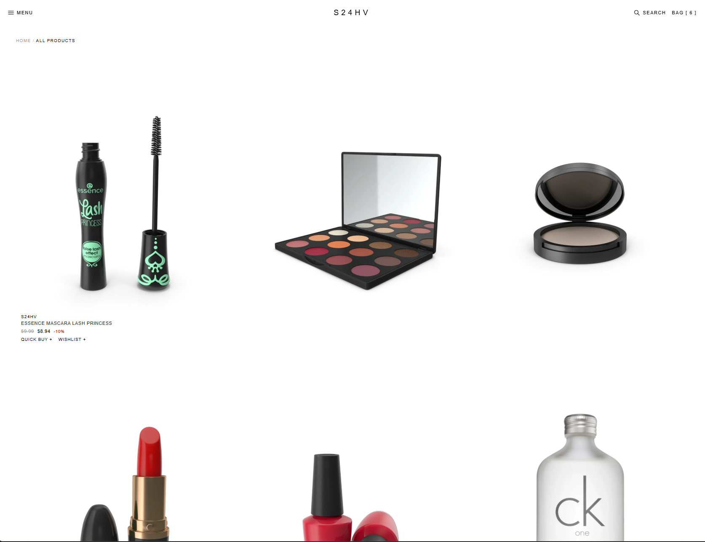

<div align="center">

# `S24HV` — Store

**E-commerce platform with product browsing, filtering, favorites, and a full cart-to-checkout flow.**

[](https://react.dev)
[](https://www.typescriptlang.org)
[](https://vite.dev)
[](https://redux-toolkit.js.org)

### [→ Live demo](https://s24hv.github.io/Store/)


</div>

---

## About

E-commerce storefront built by **Amir Sukhov** — a full browse-to-checkout flow, from the product
catalog to the cart, with state (cart contents, favorites, filters) managed centrally with Redux
Toolkit so it stays consistent across every page.

## Features

| | |
|---|---|
| **Product catalog** | Full product listing with images, pricing, and category grouping |
| **Product pages** | Dedicated page per product with details and add-to-cart |
| **Filters & search** | Narrow products by category, price, and search term |
| **Favorites** | Save products to a wishlist, persisted between visits |
| **Cart** | Add, update quantity, remove — synced across the whole app via Redux |
| **Checkout flow** | Full flow from cart review to order confirmation |
| **Responsive layout** | Works across desktop and mobile viewports |

## Screenshots

| Home | Product page |
|---|---|
|  |  |

| Cart | Checkout |
|---|---|
|  |  |

## Tech stack

| Layer | Tools |
|---|---|
| UI | React 18.3, TypeScript 5.6 |
| Build | Vite 6 |
| State | Redux Toolkit 2.5, React Redux 9 |
| Routing | React Router |
| Deploy | gh-pages → GitHub Pages |

## Quick start

```bash
git clone https://github.com/S24HV/Store.git
cd Store
npm install
npm run dev
```

Open http://localhost:5173/Store/

### Scripts

| Command | Description |
|---|---|
| `npm run dev` | Dev server with HMR |
| `npm run build` | Type-check and build into `dist/` |
| `npm run preview` | Serve the production build locally |
| `npm run lint` | ESLint over the whole project |
| `npm run deploy` | Build and publish `dist/` to the `gh-pages` branch |

## Project structure

```text
src/
├── components/      Header, ProductCard, ProductList, Cart, Checkout, Filters
├── pages/           Home, Product, Cart, Checkout
├── store/           Redux Toolkit store — cart, favorites, filters slices
├── assets/
├── global.styles.scss
└── App.tsx
docs/screenshots/    Images used in this README
```

## Deployment

```bash
npm run deploy
```

Builds the project and pushes `dist/` to the `gh-pages` branch; GitHub Pages serves it at
[s24hv.github.io/Store](https://s24hv.github.io/Store/).
The base path is set in `vite.config.ts` (`base: "/Store"`) — keep it in sync with the repository name.

## Contact

[](mailto:amirsuhov@gmail.com)
[](https://t.me/S_24_HV)
[](https://github.com/S24HV)
.
